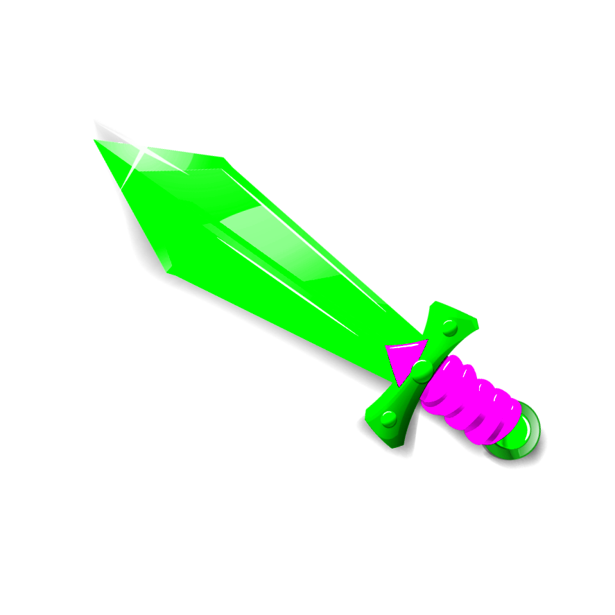
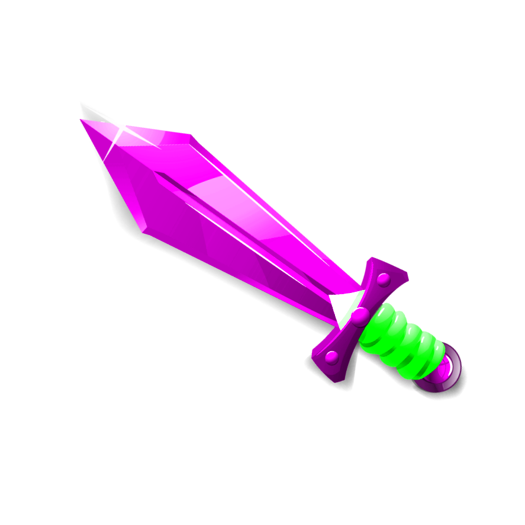

# RGB Permutations
A small java program to swap color components and generate all RGB Permutations of an image

# Preview (NFT FOR SALE)
10,000$ for a single image. Only download the image if you payed, and only one person per image please.






# License
I have a Driving License

# Contact Me
I'm always looking for work, if it pays.
```sh
muaaz.h.is@gmail.com
```

# Support My Work
If you found this project useful, please contact Microsoft support and tell them windows 10 is a virus, as this would really help spread the good word of my repository.
